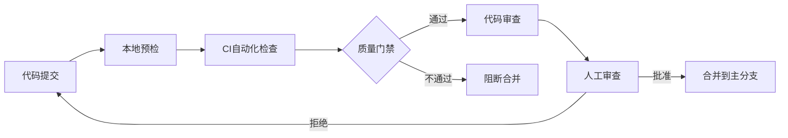

# 🛡️ 质量保障体系文档

**项目**: HotelBookingDemo  
**版本**: v1.0  
**最后更新**: 2024-03-20  

## 📋 质量保障目标

### 核心质量指标
- **测试覆盖率**: ≥ 80%
- **代码规范遵守率**: ≥ 95%
- **CI通过率**: ≥ 98%
- **缺陷修复时效**: ≤ 2个工作日
- **用户满意度**: ≥ 4.5星

## 🏗️ 质量保障架构

### 分层测试策略

```
┌─────────────────────────────────────┐
│           集成测试 (15%)            │
│  End-to-end, API集成, UI流程测试    │
├─────────────────────────────────────┤
│           系统测试 (10%)            │
│     性能测试, 安全测试, 兼容性测试   │
├─────────────────────────────────────┤
│           组件测试 (25%)            │
│   ViewModel, Service, Utility测试   │
├─────────────────────────────────────┤
│           单元测试 (50%)            │
│      Model, Helper, Core组件测试     │
└─────────────────────────────────────┘
```

### 质量门禁流程



## 🔧 质量工具链

### 静态分析工具
- **SwiftLint**: 代码风格和规范检查
- **SonarQube**: 代码质量和安全扫描
- **Periphery**: 无用代码检测
- **IBLinter**: Interface Builder文件检查

### 动态分析工具
- **XCTest**: 单元测试框架
- **Quick/Nimble**: BDD测试框架
- **SnapshotTesting**: UI快照测试
- **Instruments**: 性能分析工具

### 监控和报告
- **Codecov**: 代码覆盖率监控
- **GitHub Actions**: CI/CD流水线
- **Slack集成**: 质量通知
- **质量Dashboard**: 可视化报告

## 📊 质量度量标准

### 代码质量指标

| 指标类别 | 度量项 | 目标值 | 监控频率 |
|---------|--------|--------|----------|
| 复杂度 | 圈复杂度 | ≤ 10 | 每次提交 |
| 重复度 | 代码重复率 | ≤ 5% | 每日 |
| 规范性 | Lint违规数 | 0 | 每次构建 |
| 可维护性 | 技术债比率 | ≤ 10% | 每周 |

### 测试质量指标

| 指标 | 计算方式 | 目标值 | 说明 |
|------|----------|--------|------|
| 行覆盖率 | 已执行代码行数/总代码行数 | ≥ 80% | 基础要求 |
| 分支覆盖率 | 已执行分支数/总分支数 | ≥ 70% | 逻辑覆盖 |
| 函数覆盖率 | 已测试函数数/总函数数 | ≥ 85% | 功能覆盖 |
| 变异测试得分 | 存活变异体/总变异体 | ≥ 80% | 测试强度 |

## 🔍 审查流程规范

### 代码审查标准

#### 必须检查项
1. **功能性**
   - 实现是否符合需求
   - 边界条件是否处理完整
   - 错误处理是否健全

2. **架构合规性**
   - 是否遵循MVVM模式
   - 依赖注入是否正确使用
   - 组件职责是否单一

3. **可维护性**
   - 代码是否易于理解
   - 注释是否清晰必要
   - 命名是否规范一致

#### 建议改进项
- 性能优化机会
- 代码复用可能性
- 测试覆盖补全
- 文档完善建议

### 审查参与方责任

| 角色 | 职责 | 时间要求 |
|------|------|----------|
| 开发者 | 自检并提交高质量代码 | 提交前 |
| 同行审查员 | 技术细节审查 | 24小时内 |
| 架构师 | 架构合规性审查 | 24小时内 |
| QA工程师 | 测试覆盖审查 | 24小时内 |

## 🚨 质量异常处理

### 质量红线
触发以下任一条件将阻止代码合并：
- CI构建失败
- 测试覆盖率下降超过5%
- SwiftLint严重违规
- 安全扫描发现高危漏洞
- 性能回归超过10%

### 质量预警
出现以下情况需要特别关注：
- 技术债连续两周增长
- 测试稳定性下降
- 用户反馈质量问题增多
- 代码审查时间延长

### 改进措施
- 建立质量改进小组
- 制定专项提升计划
- 加强培训和知识分享
- 调整开发流程和标准

## 📈 持续改进机制

### 质量回顾周期
- **每日**: CI状态检查
- **每周**: 质量指标回顾
- **每月**: 质量体系评估
- **每季度**: 质量战略调整

### 改进行动项跟踪
使用Jira/GitHub Issues跟踪质量改进任务：
- 问题识别和分类
- 改进措施制定
- 执行进度跟踪
- 效果评估和反馈

## 📚 附录

### 相关文档
- [代码审查检查清单](./CodeReviewChecklist.md)
- [质量评估报告](./QualityAssessmentReport.md)
- [测试策略文档](./TestStrategy.md)

### 参考标准
- Apple Human Interface Guidelines
- Swift API Design Guidelines
- OWASP Mobile Top 10
- ISO/IEC 25010软件质量模型

---
*文档维护: Guardian Agent*  
*下次评审: 2024-04-20*